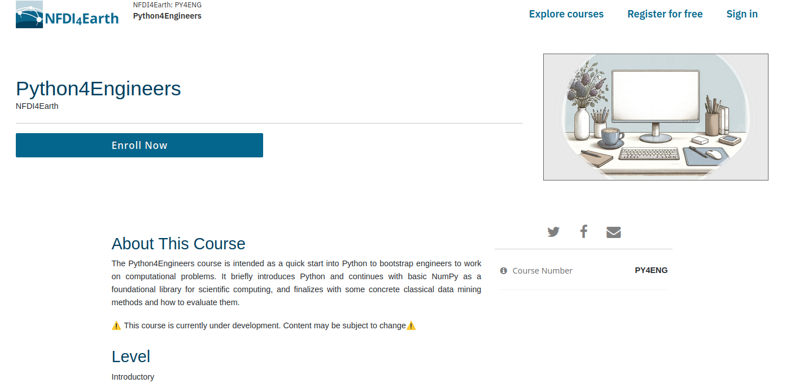
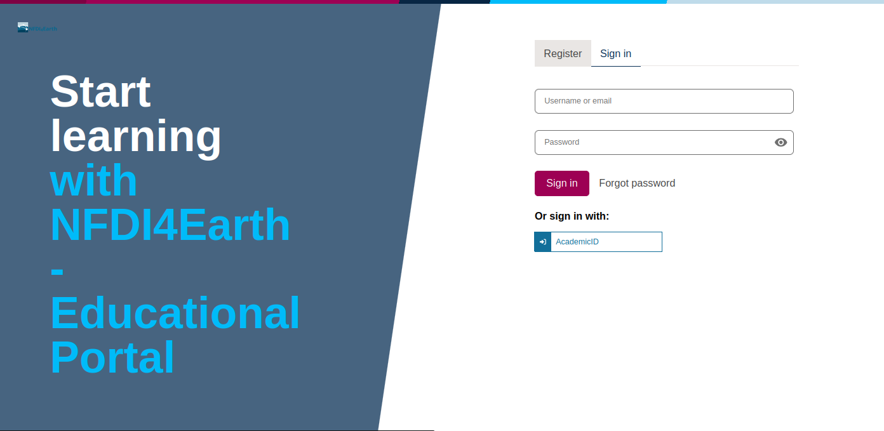
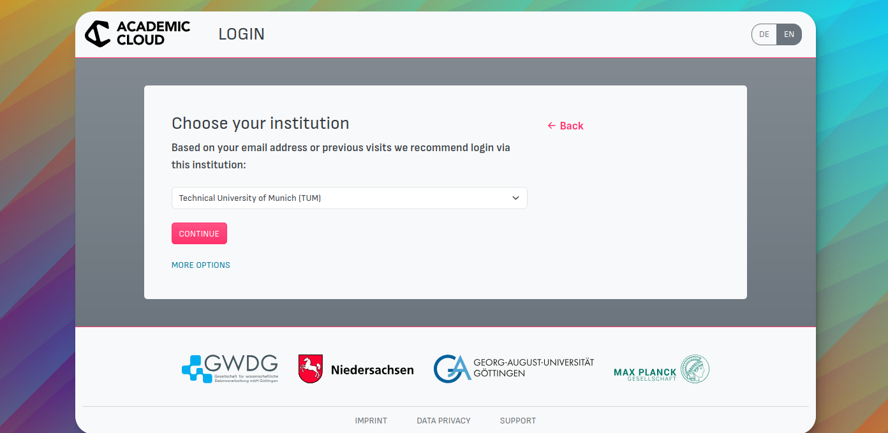
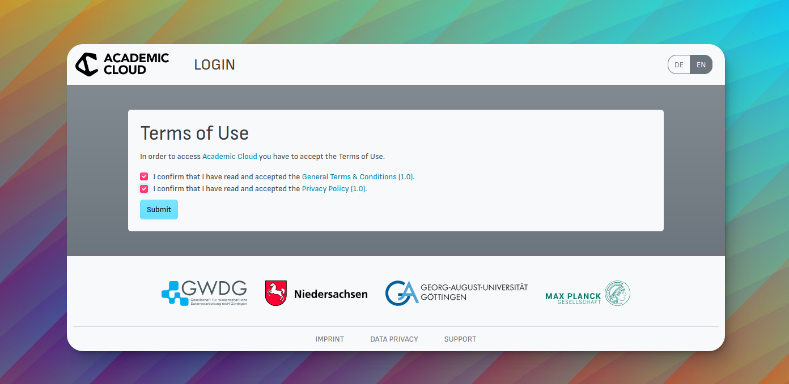
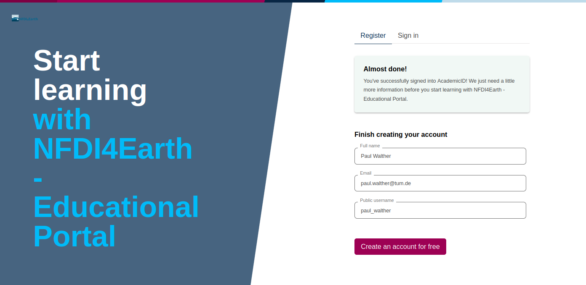
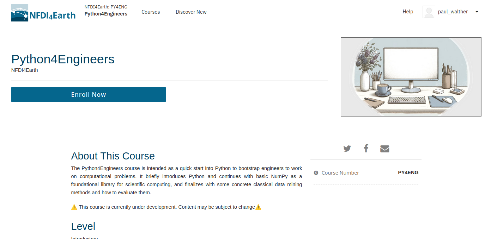

# Login To the [NFDI4Earth - Educational Portal](https://edutrain.nfdi4earth.de/)

1. Through the top right `Explore courses` tab search for the course `Python4Engineers`

Click Enroll now.
2. Login to the NFDI4EArth - Educational Portal, preferably using your `AcademicID` (click on the button below)

3. Choose `Federated Login`, select your university and sing in.

4. Accept Terms of Use.
 
5. Create NFDI4Earth Account 

6. Enroll into course

7. Activate your account by clicking the link in your mail box. 
